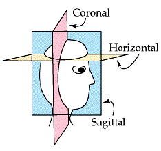

### Neuroanatomy Nomenclature

    - Anterior/rostral: in the direction of nose/head
    - Posterior/caudal: in the direction of rear, back
    - Dorsal/superior: on top
    - Ventral/inferior: on bottom
    - Lateral: towards the outer part
    - Medial: towards the inner part
    - Sagittal: brain sectioned from rostral -> caudal
    - Coronal: brain sectioned from lateral left -> lateral right

<a href="http://www.bioon.com/bioline/neurosci/course/corhor.html"> CORONAL AND HORIZONTAL SECTIONS </a>

